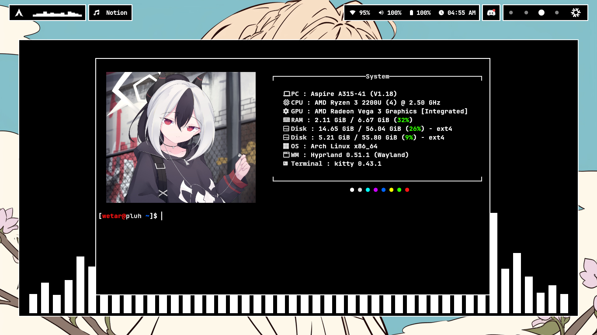
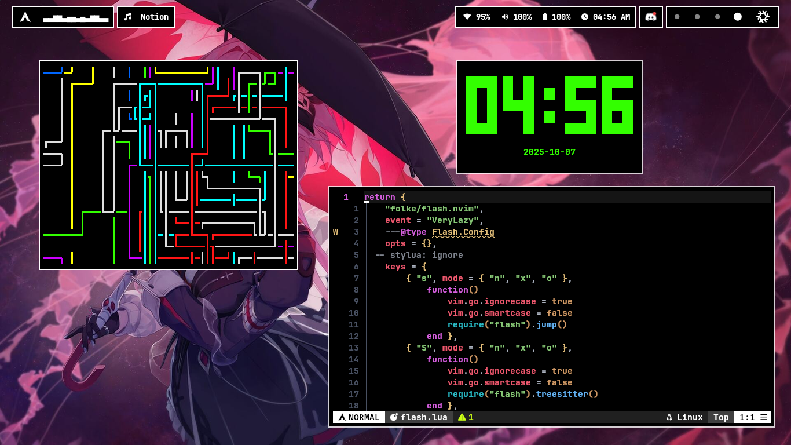

# Previews




# Introducing my rice
Wetar's rice, yeah that's me. This is just my personal rice, i use this everyday

# Installation
Just run the `setup.sh` bash script and this thing will install itself into your device 

# Keybindings
```WIN + d: App selector
WIN + SHIFT + R: Reload waybar and mako
WIN + CTRL + R: Randomize wallpaper
WIN + SHIFT + RIGHT: Next music
WIN + SHIFT + LEFT: Previous music
WIN + SHIFT + SPACE: Pause music
WIN + CTRL + RIGHT: Next workspace
WIN + CTRL + LEFT: Previous workspace
WIN + SHIFT + UP: Increase volume by 2
WIN + SHIFT + DOWN: Decrease volume by 2
WIN + E: Exit hyprland
WIN + O: Open discord
WIN + M: Open file manager
WIN + B: Open firefox
WIN + D: Open app selector
WIN + V: Toggle floating window
WIN + F: Toggle window fullscreen
WIN + Q: Close window
WIN + S: Toggle special workspace
WIN + SHIFT + S: Move window to special workspace
WIN + SHIFT + P: Run color picker
PRINT: Screenshot current monitor
WIN + PRINT: Screenshot selected window
WIN + SHIFT + PRINT: Screenshot selected region
